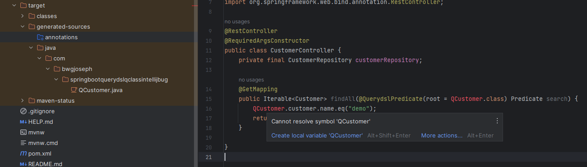
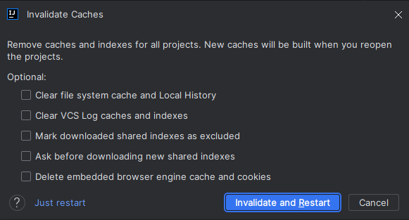
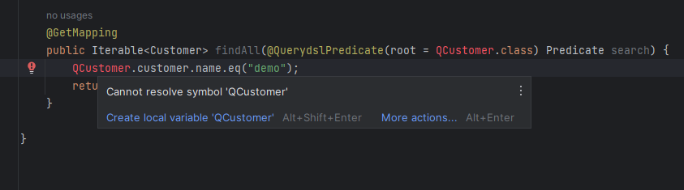

# Spring Boot Querydsl QClass Intellij Bug

I'm not 100% sure this is reproducible because when trying to make this reproduce, it works on my very first try. However, subsequent try, would result in not detecting the `QClasses` even though it is generated.

I try my best to document down the exact step I did.

- Downloaded latest [intellij community](https://download.jetbrains.com/idea/ideaIC-2023.2.1.win.zip?_gl=1*yeersw*_ga*MjAwNzcxMjMxMy4xNjczMTA2ODkz*_ga_9J976DJZ68*MTY5NDEwMjU0NS43OC4xLjE2OTQxMDI1NDkuMC4wLjA.)
  - FYI: the same happens on intellij ultimate
- Generated a brand new `Spring Boot` project via the [initializer](https://start.spring.io/#!type=maven-project&language=java&platformVersion=3.1.3&packaging=jar&jvmVersion=17&groupId=com.bwgjoseph&artifactId=spring-boot-querydsl-qclass-intellij-bug&name=spring-boot-querydsl-qclass-intellij-bug&description=Demo%20project%20for%20Spring%20Boot%20Querydsl%20Intellij%20bug&packageName=com.bwgjoseph.spring-boot-querydsl-qclass-intellij-bug&dependencies=devtools,configuration-processor,web,data-mongodb,lombok)
- Import the project into Intellij
- Creates the various classes (Customer, CustomerRepository, CustomerController)
- Add in `Querydsl` dependencies

```xml
<dependency>
    <groupId>com.querydsl</groupId>
    <artifactId>querydsl-apt</artifactId>
    <version>5.0.0</version>
    <classifier>jakarta</classifier>
    <scope>provided</scope>
</dependency>

<dependency>
    <groupId>com.querydsl</groupId>
    <artifactId>querydsl-mongodb</artifactId>
    <version>5.0.0</version>
</dependency>
```

- Add in `Querydsl` plugin

```xml
<plugin>
    <groupId>com.mysema.maven</groupId>
    <artifactId>apt-maven-plugin</artifactId>
    <version>1.1.3</version>
    <executions>
        <execution>
            <goals>
                <goal>process</goal>
            </goals>
            <configuration>
                <outputDirectory>target/generated-sources/java</outputDirectory>
                <processor>org.springframework.data.mongodb.repository.support.MongoAnnotationProcessor</processor>
            </configuration>
        </execution>
    </executions>
</plugin>
```

- Ran `./mvnw clean compile`
- `QCustomer.java` file was generated in `/target/generated-sources/java`
- Was able to navigate (ctrl + click) into `QCustomer` from `CustomerController`

So far, it works fine, and I thought I wasn't able to reproduce this.

---

I was then trying out ways to generate the `QClass` as seen in this [github issue](https://github.com/querydsl/querydsl/issues/3131#issuecomment-1549255382).

- So I added the following configuration, and removed the one that uses `apt-maven-plugin`

```xml
<plugin>
    <groupId>org.apache.maven.plugins</groupId>
    <artifactId>maven-compiler-plugin</artifactId>
    <version>3.11.0</version>
    <configuration>
        <source>${java.version}</source>
        <target>${java.version}</target>
        <annotationProcessorPaths>
            <path>
                <groupId>org.projectlombok</groupId>
                <artifactId>lombok</artifactId>
                <version>${lombok.version}</version>
            </path>
            <path>
                <groupId>com.querydsl</groupId>
                <artifactId>querydsl-apt</artifactId>
                <version>5.0.0</version>
                <classifier>jakarta</classifier>
            </path>
        </annotationProcessorPaths>
    </configuration>
</plugin>
```

- Ran `./mvnw clean compile`
- Couldn't get it to work, then I switch back to using `apt-maven-plugin`
- Ran `./mvnw clean compile` again
- This time, even though, the code compiles, and `QClasses` are generated, it seems that `Intellij` wasn't able to detect it (see image below)



- Next, I tried to clean cache and restart



- Even after restart, and re-indexing is done, it is still not recognizing `Qclass`



---

I'm not sure which steps is necessary or which is not, but I try to list down all I could remember so that maybe it could help in resolving the issue.
